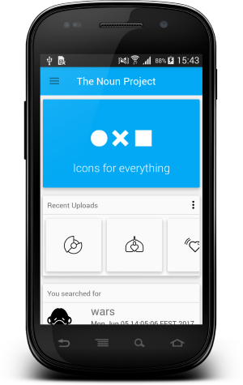
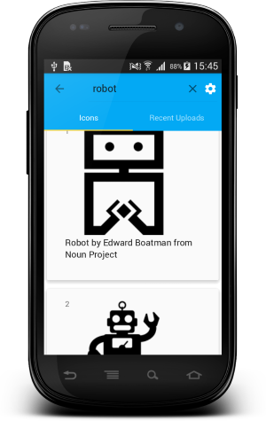

# The Noun Project for Android 

<p align="center">
  
</p>

[The Noun Project](https://thenounproject.com) is a great resource for finding clip art for use in applications.
The application is built with MVP architectural approach and uses [The Noun Project API](http://api.thenounproject.com/) for fetching data.

## Project Structure
### data 
It contains all the data(Shared Preferences, Local DB and Remote API) accessing and manipulating components
### injection
Dependency providing classes using Dagger2
### events
EventBus events classes that simplifies communication between Activitie and Fragments
### ui
View classes along with their corresponding Presenters
### utils
Utility classes

## Preview

Main Activity|Icons Activity 
-------------|-----------------
  |  


Collections Activity|Detail Activity
-------------|-----------------
 |   


## Contributing

Contributions are welcome to the project. Make pull request and you are IN!

### Reporting Bugs & Bug Fixes

If you find a bug you can report it by using the [issues section](https://github.com/graviton57/TheNounProject/issues) for this project. Bug fixes should also be done in pull requests.

### Features & Feature Requests

If there is some feature you want to implement, I invite you to do a pull request.

Feature request should be reported in the [issues section](https://github.com/graviton57/TheNounProject/issues) for this project.

## Graphics & Icons

### The Noun Project

[The Noun Project](http://www.thenounproject.com) is the source for some the graphics used in this application.


### The Noun Project API Keys

To obtain api keys for The Noun Project visit the [Getting Started](http://api.thenounproject.com/getting_started.html) page for additional information

Once you have the API key and secret, replace the placeholder values in: `/api.gradle`.
```groovy
ext {
          
     NOUN_DEV_API_KEY = "PASTE_YOUR_API_KEY";
     NOUN_DEV_SECRET_API_KEY = "PASTE_YOUR_SECRET_API_KEY";
}
 ```

## Library reference resources
- [Support library](https://developer.android.com/topic/libraries/support-library/index.html)
- [RxJava2](https://github.com/ReactiveX/RxJava), [RxAndroid](https://github.com/ReactiveX/RxAndroid) and [RxBindings](https://github.com/JakeWharton/RxBinding)
- [Dagger2](https://google.github.io/dagger/)
- [Retrofit2](http://square.github.io/retrofit/)
- [Okhttp3](https://github.com/square/okhttp/)
- [GreenDao](http://greenrobot.org/greendao/)
- [Butterknife](https://github.com/JakeWharton/butterknife)
- [Greenrobot EventBus](http://greenrobot.org/eventbus/)
- [Lottie-Android](https://github.com/airbnb/lottie-android)
- [Timber](https://github.com/JakeWharton/timber)
- [Fresco - A powerful image downloading and caching library for Android](https://github.com/facebook/fresco/)

## Testing reference resources
- [Mockito](http://site.mockito.org/)
- [Robolectric](http://robolectric.org/) 
- [Travis CI - Continuos integration platform](https://travis-ci.org/)


# License
```                                  
   Copyright 2017 Igor Gavrilyuk

   Licensed under the Apache License, Version 2.0 (the "License");
   you may not use this file except in compliance with the License.
   You may obtain a copy of the License at

       http://www.apache.org/licenses/LICENSE-2.0

   Unless required by applicable law or agreed to in writing, software
   distributed under the License is distributed on an "AS IS" BASIS,
   WITHOUT WARRANTIES OR CONDITIONS OF ANY KIND, either express or implied.
   See the License for the specific language governing permissions and
   limitations under the License.
```
